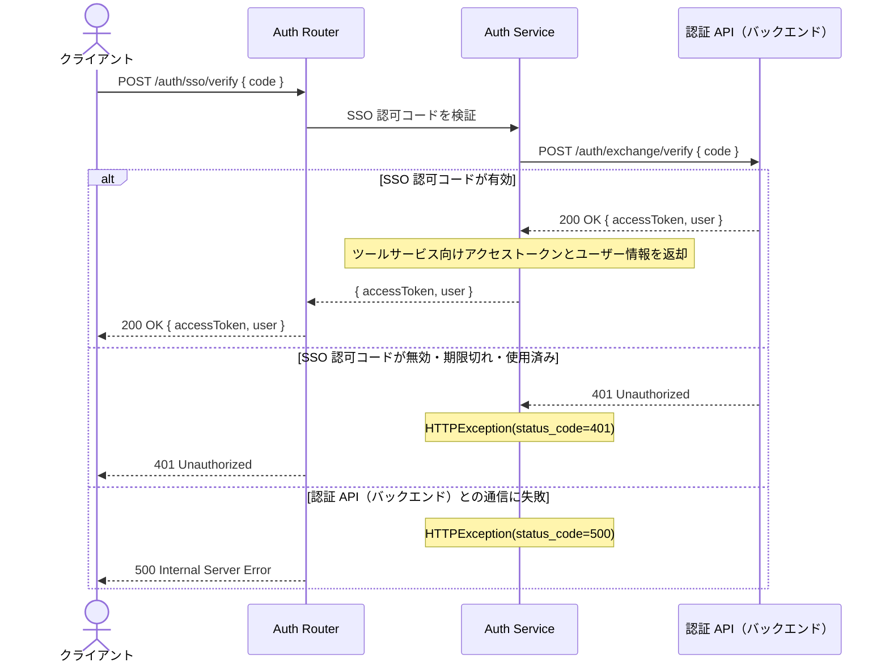
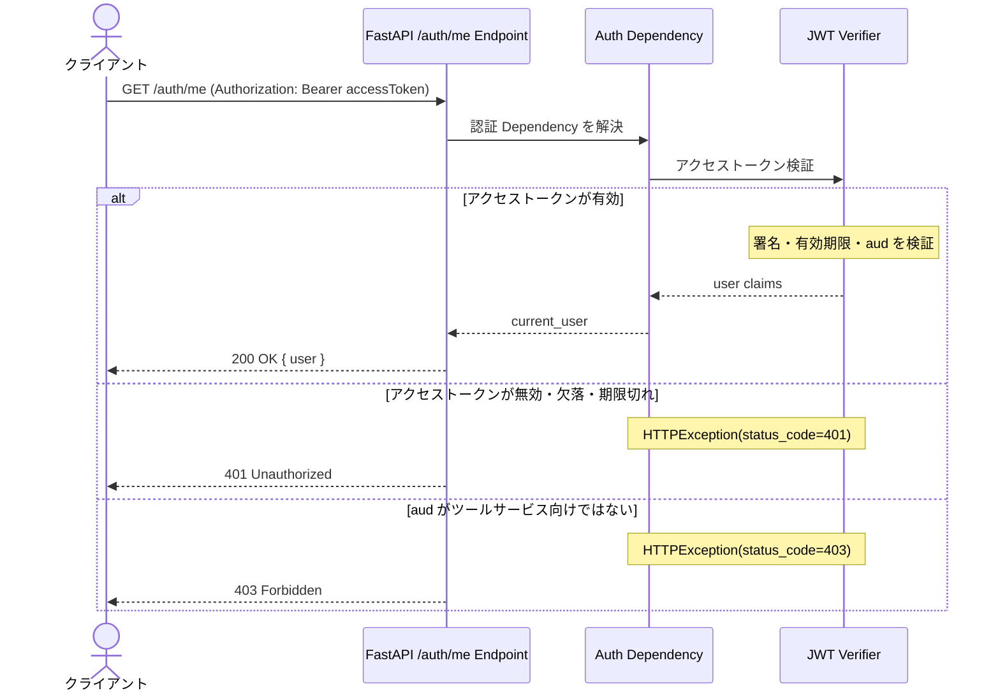
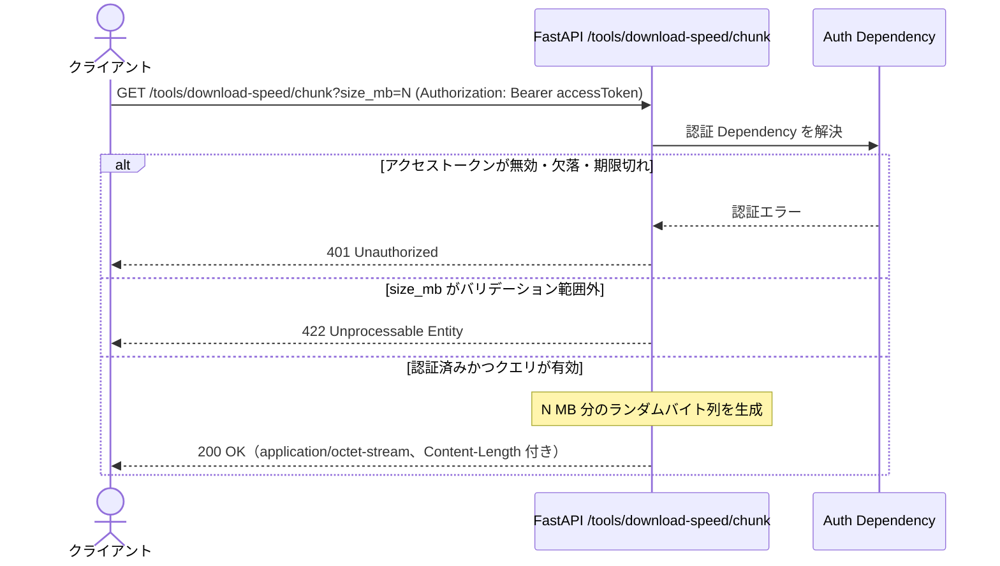

# API 仕様 - Waddle Inc. ツールサービス API

このドキュメントはツールサービス API の仕様を定義しています。

> **閲覧環境について**  
> Mermaid 図は [Mermaid 対応エディタ](https://mermaid.js.org/)（GitHub、Obsidian 等）で正しくレンダリングされます。

---

## 目次

<!-- toc -->

- [ベース情報](#%E3%83%99%E3%83%BC%E3%82%B9%E6%83%85%E5%A0%B1)
- [共通レスポンス](#%E5%85%B1%E9%80%9A%E3%83%AC%E3%82%B9%E3%83%9D%E3%83%B3%E3%82%B9)
  - [400 Bad Request](#400-bad-request)
  - [401 Unauthorized](#401-unauthorized)
  - [403 Forbidden](#403-forbidden)
  - [500 Internal Server Error](#500-internal-server-error)
- [API 一覧](#api-%E4%B8%80%E8%A6%A7)
- [エンドポイント詳細](#%E3%82%A8%E3%83%B3%E3%83%89%E3%83%9D%E3%82%A4%E3%83%B3%E3%83%88%E8%A9%B3%E7%B4%B0)
  - [POST /auth/sso/verify](#post-authssoverify)
    - [リクエスト](#%E3%83%AA%E3%82%AF%E3%82%A8%E3%82%B9%E3%83%88)
    - [レスポンス](#%E3%83%AC%E3%82%B9%E3%83%9D%E3%83%B3%E3%82%B9)
    - [処理内容](#%E5%87%A6%E7%90%86%E5%86%85%E5%AE%B9)
  - [GET /auth/me](#get-authme)
    - [リクエスト](#%E3%83%AA%E3%82%AF%E3%82%A8%E3%82%B9%E3%83%88-1)
    - [レスポンス](#%E3%83%AC%E3%82%B9%E3%83%9D%E3%83%B3%E3%82%B9-1)
    - [処理内容](#%E5%87%A6%E7%90%86%E5%86%85%E5%AE%B9-1)
  - [GET /tools/browser-info](#get-toolsbrowser-info)
    - [リクエスト](#%E3%83%AA%E3%82%AF%E3%82%A8%E3%82%B9%E3%83%88-2)
    - [レスポンス](#%E3%83%AC%E3%82%B9%E3%83%9D%E3%83%B3%E3%82%B9-2)
    - [処理内容](#%E5%87%A6%E7%90%86%E5%86%85%E5%AE%B9-2)
  - [GET /tools/download-speed/chunk](#get-toolsdownload-speedchunk)
    - [リクエスト](#%E3%83%AA%E3%82%AF%E3%82%A8%E3%82%B9%E3%83%88-3)
    - [レスポンス](#%E3%83%AC%E3%82%B9%E3%83%9D%E3%83%B3%E3%82%B9-3)
    - [処理内容](#%E5%87%A6%E7%90%86%E5%86%85%E5%AE%B9-3)
  - [POST /tools/summarize](#post-toolssummarize)
    - [リクエスト](#%E3%83%AA%E3%82%AF%E3%82%A8%E3%82%B9%E3%83%88-4)
    - [レスポンス](#%E3%83%AC%E3%82%B9%E3%83%9D%E3%83%B3%E3%82%B9-4)
    - [処理内容](#%E5%87%A6%E7%90%86%E5%86%85%E5%AE%B9-4)

<!-- tocstop -->

## ベース情報

| 項目       | 内容                                                  |
| ---------- | ----------------------------------------------------- |
| ベース URL | `/`                                                   |
| データ形式 | JSON                                                  |
| 文字コード | UTF-8                                                 |
| 認証方式   | Bearer トークン（ツールサービス向けアクセストークン） |

---

## 共通レスポンス

共通で使用するエラーレスポンスを定義します。

### 400 Bad Request

リクエストボディやクエリパラメータが不正な場合のレスポンスです。

```json
{
  "detail": "バリデーションエラー"
}
```

バリデーションエラーが複数ある場合、`detail` は配列になります。

```json
{
  "detail": [
    {
      "type": "string_too_short",
      "loc": ["body", "code"],
      "msg": "String should have at least 1 character",
      "input": ""
    }
  ]
}
```

### 401 Unauthorized

認証情報が無効、欠落、期限切れの場合のレスポンスです。

```json
{
  "detail": "Unauthorized"
}
```

### 403 Forbidden

認証済みだが、操作に必要な権限がない場合のレスポンスです。

```json
{
  "detail": "Forbidden"
}
```

### 500 Internal Server Error

サーバーエラーが発生した場合のレスポンスです。

```json
{
  "detail": "Internal Server Error"
}
```

---

## API 一覧

| メソッド | パス                          | 概要                                                             | 認証 |
| -------- | ----------------------------- | ---------------------------------------------------------------- | ---- |
| `POST`   | `/auth/sso/verify`            | SSO 認可コードを検証し、ツールサービス向けアクセストークンを返す | 不要 |
| `GET`    | `/auth/me`                    | ログイン中ユーザー情報を返す                                     | 必要 |
| `GET`    | `/tools/browser-info`         | サーバーから見たクライアント情報を返す                           | 必要 |
| `GET`    | `/tools/download-speed/chunk` | 計測用のランダムバイト列を指定サイズで返す                       | 必要 |
| `POST`   | `/tools/summarize`            | 入力テキストを Gemini で要約して返す                             | 必要 |

---

## エンドポイント詳細

### POST /auth/sso/verify

認証 WEB（フロントエンド）から受け取った SSO 認可コードを検証し、ツールサービス API（バックエンド）で使用するツールサービス向けアクセストークンとユーザー情報を返します。

このエンドポイントはツールサービス WEB（フロントエンド）から呼び出されます。ツールサービス API（バックエンド）は、受け取った SSO 認可コードを認証 API（バックエンド）の `/auth/exchange/verify` へ送信して検証します。

#### リクエスト

```json
{
  "code": "<SSO 認可コード>"
}
```

| フィールド | 型     | 必須 | 説明                                                    |
| ---------- | ------ | ---- | ------------------------------------------------------- |
| `code`     | string | ✓    | 認証 WEB（フロントエンド）から返却された SSO 認可コード |

#### レスポンス

| ステータス                  | 説明                                         |
| --------------------------- | -------------------------------------------- |
| `200 OK`                    | SSO 認可コード検証成功                       |
| `400 Bad Request`           | リクエストボディ不正                         |
| `401 Unauthorized`          | SSO 認可コード不正、期限切れ、または使用済み |
| `500 Internal Server Error` | サーバーエラー                               |

**200 OK**

```json
{
  "accessToken": "<ツールサービス向けアクセストークン>",
  "user": {
    "id": "<ユーザー ID>",
    "email": "user@example.com",
    "roles": ["customer"]
  }
}
```

| フィールド    | 型       | 説明                                                   |
| ------------- | -------- | ------------------------------------------------------ |
| `accessToken` | string   | ツールサービス API（バックエンド）の認証に使用する JWT |
| `user.id`     | string   | ユーザー ID                                            |
| `user.email`  | string   | メールアドレス                                         |
| `user.roles`  | string[] | ロール一覧                                             |

**401 Unauthorized**

```json
{
  "detail": "SSO 認可コードが無効または期限切れです"
}
```

#### 処理内容



---

### GET /auth/me

ツールサービス向けアクセストークンを検証し、ログイン中ユーザー情報を返します。

#### リクエスト

```text
Authorization: Bearer <ツールサービス向けアクセストークン>
```

リクエストボディなし。

#### レスポンス

| ステータス                  | 説明                                                  |
| --------------------------- | ----------------------------------------------------- |
| `200 OK`                    | ユーザー情報取得成功                                  |
| `401 Unauthorized`          | アクセストークンが無効、欠落、または期限切れ          |
| `403 Forbidden`             | アクセストークンの `aud` がツールサービス向けではない |
| `500 Internal Server Error` | サーバーエラー                                        |

**200 OK**

```json
{
  "user": {
    "id": "<ユーザー ID>",
    "email": "user@example.com",
    "roles": ["customer"]
  }
}
```

| フィールド   | 型       | 説明           |
| ------------ | -------- | -------------- |
| `user.id`    | string   | ユーザー ID    |
| `user.email` | string   | メールアドレス |
| `user.roles` | string[] | ロール一覧     |

**401 Unauthorized**

```json
{
  "detail": "Unauthorized"
}
```

**403 Forbidden**

```json
{
  "detail": "Forbidden"
}
```

#### 処理内容



---

### GET /tools/browser-info

サーバーから見たクライアント IP アドレスを返します。ブラウザ情報ツール画面の IP 表示に利用します。

#### リクエスト

```text
Authorization: Bearer <ツールサービス向けアクセストークン>
```

リクエストボディなし。

#### レスポンス

| ステータス         | 説明                                         |
| ------------------ | -------------------------------------------- |
| `200 OK`           | クライアント情報取得成功                     |
| `401 Unauthorized` | アクセストークンが無効、欠落、または期限切れ |

**200 OK**

```json
{
  "client_ip": "203.0.113.1"
}
```

`client_ip` は `null` の場合があります（接続環境により IP を取得できない場合）。

**401 Unauthorized**

```json
{
  "detail": "Unauthorized"
}
```

#### 処理内容

- 認証 dependency でアクセストークンを検証
- `X-Forwarded-For` ヘッダーがあれば先頭の IP を採用
- ヘッダーがなければ `request.client.host` を返却

---

### GET /tools/download-speed/chunk

認証済みユーザー向けに、ダウンロード速度計測用のランダムバイト列を返します。レスポンスボディは JSON ではなくバイナリ（`application/octet-stream`）です。フロントエンドは取得に要した時間とバイト数から Mbps を算出します。

#### リクエスト

```text
GET /tools/download-speed/chunk?size_mb=<整数>
Authorization: Bearer <ツールサービス向けアクセストークン>
```

| クエリパラメータ | 型      | 必須 | 説明                                                                        |
| ---------------- | ------- | ---- | --------------------------------------------------------------------------- |
| `size_mb`        | integer | 任意 | 返却するデータサイズ（メガバイト単位）。省略時は `10`。最小 `1`、最大 `100` |

リクエストボディなし。

#### レスポンス

| ステータス                 | 説明                                                                                                  |
| -------------------------- | ----------------------------------------------------------------------------------------------------- |
| `200 OK`                   | 指定サイズのランダムバイト列を返却。`Content-Type: application/octet-stream`、`Content-Length` を付与 |
| `422 Unprocessable Entity` | `size_mb` が許容範囲外など、クエリのバリデーションエラー（[共通レスポンス](#共通レスポンス)の形式）   |
| `401 Unauthorized`         | アクセストークンが無効、欠落、または期限切れ                                                          |

**200 OK**

- **ボディ:** `size_mb × 1024 × 1024` バイトの乱数バイト列（サーバーは暗号論的乱数源により生成する想定）
- **ヘッダー例:**

```http
Content-Type: application/octet-stream
Content-Length: <バイト長>
```

**401 Unauthorized**

```json
{
  "detail": "Unauthorized"
}
```

**422 Unprocessable Entity**

クエリ `size_mb` が範囲外の場合など（[共通レスポンス](#共通レスポンス)のバリデーションエラー形式）。

#### 処理内容



---

### POST /tools/summarize

認証済みユーザーが送信したテキストを、Google Gemini API（モデル `gemini-2.5-flash-lite`）で要約し、一括レスポンスとして JSON で返します。ストリーミングは行いません。

#### リクエスト

```text
Authorization: Bearer <ツールサービス向けアクセストークン>
Content-Type: application/json
```

```json
{
  "text": "<要約対象のテキスト>",
  "length": "short"
}
```

| フィールド | 型     | 必須 | 説明                                                                                          |
| ---------- | ------ | ---- | --------------------------------------------------------------------------------------------- |
| `text`     | string | ✓    | 要約対象。1 文字以上 10,000 文字以内                                                          |
| `length`   | string | 任意 | 要約の分量。`short`（短め）／`medium`（普通・既定）／`long`（詳しく）。プロンプトの指示に反映 |

#### レスポンス

| ステータス                 | 説明                                                                     |
| -------------------------- | ------------------------------------------------------------------------ |
| `200 OK`                   | 要約テキストを返却                                                       |
| `401 Unauthorized`         | アクセストークンが無効、欠落、または期限切れ                             |
| `422 Unprocessable Entity` | `text` の長さや `length` の値が不正（[共通レスポンス](#共通レスポンス)） |
| `429 Too Many Requests`    | Gemini API の無料枠・レート制限などにより一時的に利用できない場合         |
| `502 Bad Gateway`          | Gemini API の呼び出しに失敗した場合                                      |

**200 OK**

```json
{
  "summary": "<要約結果のテキスト>"
}
```

| フィールド | 型     | 説明             |
| ---------- | ------ | ---------------- |
| `summary`  | string | モデル出力の要約 |

**401 Unauthorized**

```json
{
  "detail": "Unauthorized"
}
```

**429 Too Many Requests**

無料枠のリクエスト数・入力トークンなどの上限に達した場合など、Google 側が `RESOURCE_EXHAUSTED` を返したときに返します。メッセージに示される待ち時間（例: 約 60 秒）を置いてから再試行するか、[レート制限のドキュメント](https://ai.google.dev/gemini-api/docs/rate-limits)に従って利用頻度を調整してください。

**502 Bad Gateway**

Gemini 側の障害・タイムアウト・不正レスポンスなど、サーバーが外部 API から有効な要約を得られなかった場合に返します。

#### 処理内容

- 認証 dependency でアクセストークンを検証する
- リクエストボディをバリデーションする（`text` の長さ、`length` の列挙値）
- `google-genai` クライアントで `gemini-2.5-flash-lite` に対し、`length` に応じた分量指示を含むプロンプトで `generate_content` を呼び出す（一括取得）
- 成功時は `summary` にモデル出力のテキストを格納して返す
- Gemini がレート制限・クォータ超過（HTTP 429 相当）を返した場合は `429 Too Many Requests` を返す
- その他の Gemini 呼び出し失敗時は `502 Bad Gateway` を返す
