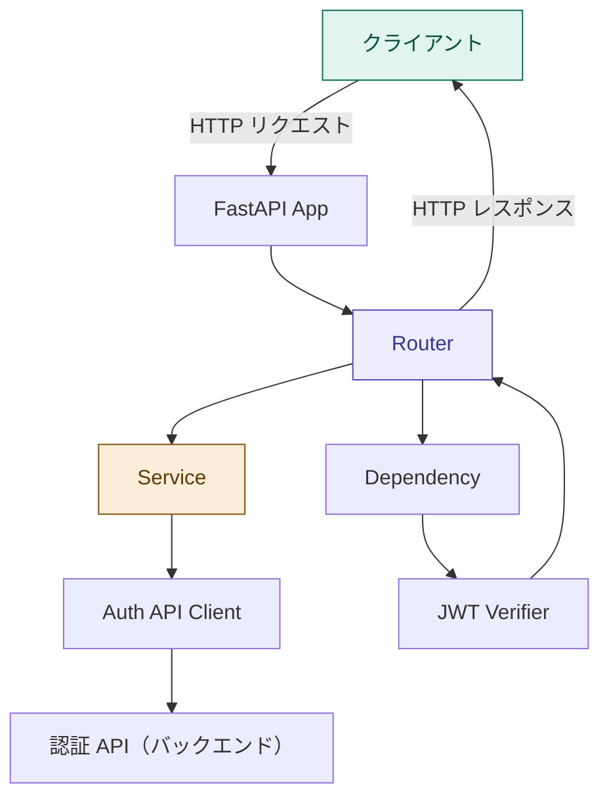

# アーキテクチャ設計 - Waddle Inc. ツールサービス API

このドキュメントはツールサービス API のアーキテクチャ設計を定義しています。

> **閲覧環境について**  
> Mermaid 図は [Mermaid 対応エディタ](https://mermaid.js.org/)（GitHub、Obsidian 等）で正しくレンダリングされます。

---

## 目次

<!-- toc -->

- [概要](#%E6%A6%82%E8%A6%81)
- [レイヤー構成](#%E3%83%AC%E3%82%A4%E3%83%A4%E3%83%BC%E6%A7%8B%E6%88%90)
- [各レイヤーの責務](#%E5%90%84%E3%83%AC%E3%82%A4%E3%83%A4%E3%83%BC%E3%81%AE%E8%B2%AC%E5%8B%99)
  - [FastAPI App](#fastapi-app)
  - [Router](#router)
  - [Schema](#schema)
  - [Service](#service)
  - [Auth API Client](#auth-api-client)
  - [Dependency](#dependency)
  - [JWT Verifier](#jwt-verifier)
  - [Settings](#settings)
- [モジュール構成](#%E3%83%A2%E3%82%B8%E3%83%A5%E3%83%BC%E3%83%AB%E6%A7%8B%E6%88%90)
- [依存関係ルール](#%E4%BE%9D%E5%AD%98%E9%96%A2%E4%BF%82%E3%83%AB%E3%83%BC%E3%83%AB)

<!-- tocstop -->

## 概要

ツールサービス API（バックエンド）は FastAPI を軸に、以下のレイヤーで構成します。  
Phase 1-b では DB を持たず、認証 API（バックエンド）との SSO 連携とツールサービス向けアクセストークンの検証に責務を限定します。



---

## レイヤー構成

| レイヤー        | 主な役割                                                             | 主なファイル              |
| --------------- | -------------------------------------------------------------------- | ------------------------- |
| FastAPI App     | アプリケーション生成、Router 登録、共通設定                          | `main.py`, `app/main.py`  |
| Router          | URL パス・HTTP メソッドを定義し、リクエスト/レスポンスを変換する     | `app/routers/*.py`        |
| Schema          | リクエスト/レスポンスの型定義と入力バリデーション                    | `app/schemas/*.py`        |
| Service         | ユースケースの実装。外部 API クライアントや検証処理を組み合わせる    | `app/services/*.py`       |
| Auth API Client | 認証 API（バックエンド）への HTTP 通信を担当する                     | `app/clients/auth_api.py` |
| Dependency      | 認証・設定など、Router に注入する共通処理を定義する                  | `app/dependencies/*.py`   |
| JWT Verifier    | ツールサービス向けアクセストークンの署名・有効期限・`aud` を検証する | `app/auth/jwt.py`         |
| Settings        | 環境変数を読み込み、アプリ全体の設定値を提供する                     | `app/core/settings.py`    |

---

## 各レイヤーの責務

### FastAPI App

**ファイル**: `main.py`, `app/main.py`

FastAPI アプリケーションを生成し、Router や共通設定を登録します。

**担当する処理**:

- FastAPI インスタンスの生成
- Router の登録
- CORS などのアプリ共通設定
- ヘルスチェック用エンドポイントの登録

**担当しない処理**:

- 認証連携のビジネスロジック
- JWT 検証の詳細
- 外部 API 通信の詳細

---

### Router

**ファイル**: `app/routers/*.py`

HTTP リクエストを受け取り、Service に処理を委譲して、HTTP レスポンスを返します。

**担当する処理**:

- URL パス・HTTP メソッドの定義
- リクエストボディ・ヘッダーの受け取り
- Dependency の適用
- Service の呼び出し
- レスポンス Schema の返却

**担当しない処理**:

- 認証 API（バックエンド）への直接通信
- JWT の署名検証
- ユースケースの詳細ロジック

---

### Schema

**ファイル**: `app/schemas/*.py`

Router とクライアント間のデータ形式を定義します。FastAPI と Pydantic により、入力バリデーションと OpenAPI スキーマ生成にも利用します。

**命名規則**:

| 種別       | 命名             | 例                  |
| ---------- | ---------------- | ------------------- |
| リクエスト | `{機能}Request`  | `SsoVerifyRequest`  |
| レスポンス | `{機能}Response` | `SsoVerifyResponse` |
| 内部モデル | `{対象}`         | `AuthenticatedUser` |

---

### Service

**ファイル**: `app/services/*.py`

ユースケースの実装を担当します。Phase 1-b では、SSO 認可コードの検証処理が主な責務です。

**担当する処理**:

- SSO 認可コード検証のユースケース実行
- Auth API Client の呼び出し
- 認証 API（バックエンド）のレスポンスをツールサービス API（バックエンド）のレスポンスへ変換
- 外部 API エラーを FastAPI の `HTTPException` へ変換

**担当しない処理**:

- HTTP パス・メソッドの定義
- Pydantic Schema のバリデーション
- JWT 署名検証の詳細

---

### Auth API Client

**ファイル**: `app/clients/auth_api.py`

認証 API（バックエンド）への HTTP 通信を担当します。Service からのみ呼び出します。

**担当する処理**:

- `POST /auth/exchange/verify` の呼び出し
- タイムアウト設定
- 認証 API（バックエンド）のレスポンスステータスの解釈
- 通信エラーの変換

**担当しない処理**:

- Router への直接依存
- ユーザー向けレスポンス形式の決定
- ツールサービス向けアクセストークンの検証

---

### Dependency

**ファイル**: `app/dependencies/*.py`

Router に注入する共通処理を定義します。Phase 1-b では、ログイン中ユーザーを取得する `get_current_user` を中心に利用します。

**処理フロー**:

```text
リクエスト
  ↓
Authorization ヘッダーから Bearer トークンを抽出
  ↓
JWT Verifier で署名・有効期限・aud を検証
  ↓
AuthenticatedUser を Router に渡す
```

---

### JWT Verifier

**ファイル**: `app/auth/jwt.py`

ツールサービス向けアクセストークンを検証します。

**確認項目**:

| 項目     | 内容                                                 |
| -------- | ---------------------------------------------------- |
| 署名     | 認証システムと共有する方式で JWT 署名を検証する      |
| 有効期限 | `exp` が期限切れでないことを確認する                 |
| 受信者   | `aud` がツールサービス向けであることを確認する       |
| ユーザー | `sub`, `email`, `roles` をユーザー情報として取り出す |

検証失敗時の扱い:

| 条件                         | レスポンス         |
| ---------------------------- | ------------------ |
| Authorization ヘッダーがない | `401 Unauthorized` |
| Bearer 形式でない            | `401 Unauthorized` |
| 署名不正・期限切れ           | `401 Unauthorized` |
| `aud` 不一致                 | `403 Forbidden`    |

---

### Settings

**ファイル**: `app/core/settings.py`

環境変数を読み込み、アプリ全体で利用する設定値を提供します。

**主な設定値**:

| 設定                       | 用途                                            |
| -------------------------- | ----------------------------------------------- |
| `AUTH_API_URL`             | 認証 API（バックエンド）のベース URL            |
| `TOOLS_JWT_AUDIENCE`       | ツールサービス向けアクセストークンの `aud` 検証 |
| `JWT_SECRET`               | ツールサービス向けアクセストークンの署名検証    |
| `AUTH_API_TIMEOUT_SECONDS` | 認証 API（バックエンド）通信のタイムアウト      |

---

## モジュール構成

Phase 1-b では以下の構成を基本とします。

```text
apps/api/
├── main.py
└── app/
    ├── __init__.py
    ├── main.py
    ├── auth/
    │   └── jwt.py
    ├── clients/
    │   └── auth_api.py
    ├── core/
    │   └── settings.py
    ├── dependencies/
    │   └── auth.py
    ├── routers/
    │   └── auth.py
    ├── schemas/
    │   └── auth.py
    └── services/
        └── auth.py
```

| モジュール          | 提供するもの                   | 依存するもの                                         |
| ------------------- | ------------------------------ | ---------------------------------------------------- |
| `routers.auth`      | `/auth/sso/verify`, `/auth/me` | `services.auth`, `dependencies.auth`, `schemas.auth` |
| `services.auth`     | SSO 認可コード検証ユースケース | `clients.auth_api`                                   |
| `clients.auth_api`  | 認証 API（バックエンド）通信   | `core.settings`, `httpx`                             |
| `dependencies.auth` | 現在ユーザー取得               | `auth.jwt`                                           |
| `auth.jwt`          | JWT 検証                       | `core.settings`                                      |
| `core.settings`     | 環境変数読み込み               | —                                                    |

---

## 依存関係ルール

各レイヤーが依存できる方向を以下に示します。上位レイヤーが下位レイヤーに依存し、逆方向の依存は禁止です。

```text
Router
  ↓ 依存可
Service
  ↓ 依存可
Auth API Client

Router
  ↓ 依存可
Dependency
  ↓ 依存可
JWT Verifier
```

**ルール一覧**:

| ルール                                                          | 理由                                                  |
| --------------------------------------------------------------- | ----------------------------------------------------- |
| Router は Service / Dependency にのみ依存する                   | HTTP 層とユースケースを分離する                       |
| Service は Router に依存しない                                  | ユースケースを HTTP 以外からもテストしやすくする      |
| Auth API Client は Service からのみ呼び出す                     | 外部 API 通信の責務を集約する                         |
| JWT Verifier は Router に依存しない                             | 認証検証ロジックを再利用しやすくする                  |
| Settings は下位レイヤーから参照されるが、他レイヤーへ依存しない | 設定値の取得を一方向に保つ                            |
| Phase 1-b では DB へ依存しない                                  | 認証連携のみを実装し、永続化は Phase 2 以降で検討する |
