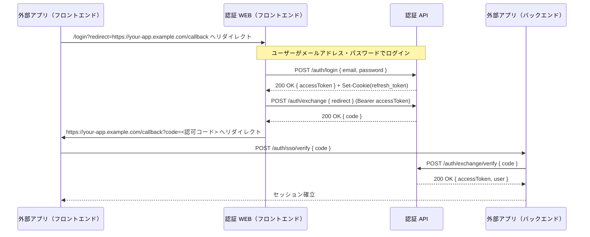
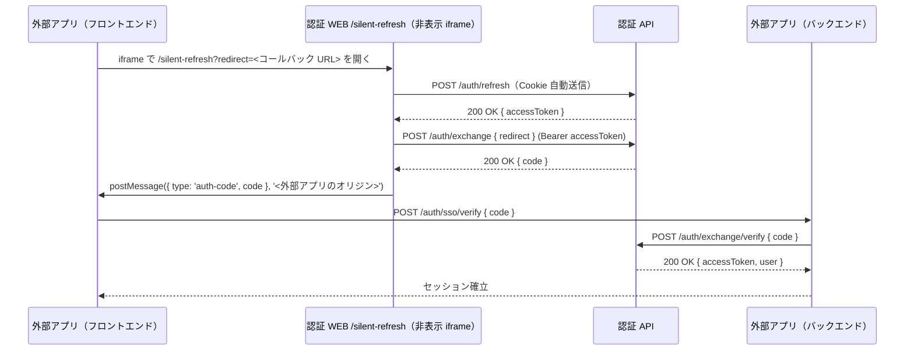

# 認証システム SSO 連携ガイド

認証システムの SSO 連携機能を利用する外部アプリ向けの実装ガイドです。

認証システムは OAuth 2.0 の認可コードフローに類似した方式で SSO 連携を提供します。外部アプリは認証システムのセッションを借りてユーザー認証を行い、認可コードを介して外部アプリ向けのアクセストークンを取得します。

---

## 目次

<!-- toc -->

- [前提条件](#%E5%89%8D%E6%8F%90%E6%9D%A1%E4%BB%B6)
- [未認証ユーザーのログインフロー](#%E6%9C%AA%E8%AA%8D%E8%A8%BC%E3%83%A6%E3%83%BC%E3%82%B6%E3%83%BC%E3%81%AE%E3%83%AD%E3%82%B0%E3%82%A4%E3%83%B3%E3%83%95%E3%83%AD%E3%83%BC)
  - [各ステップの実装ポイント](#%E5%90%84%E3%82%B9%E3%83%86%E3%83%83%E3%83%97%E3%81%AE%E5%AE%9F%E8%A3%85%E3%83%9D%E3%82%A4%E3%83%B3%E3%83%88)
- [認証済みユーザーのサイレントリフレッシュフロー](#%E8%AA%8D%E8%A8%BC%E6%B8%88%E3%81%BF%E3%83%A6%E3%83%BC%E3%82%B6%E3%83%BC%E3%81%AE%E3%82%B5%E3%82%A4%E3%83%AC%E3%83%B3%E3%83%88%E3%83%AA%E3%83%95%E3%83%AC%E3%83%83%E3%82%B7%E3%83%A5%E3%83%95%E3%83%AD%E3%83%BC)
  - [実装ポイント](#%E5%AE%9F%E8%A3%85%E3%83%9D%E3%82%A4%E3%83%B3%E3%83%88)
- [実装例](#%E5%AE%9F%E8%A3%85%E4%BE%8B)
  - [フロントエンド: ログイン開始（リダイレクト方式）](#%E3%83%95%E3%83%AD%E3%83%B3%E3%83%88%E3%82%A8%E3%83%B3%E3%83%89-%E3%83%AD%E3%82%B0%E3%82%A4%E3%83%B3%E9%96%8B%E5%A7%8B%E3%83%AA%E3%83%80%E3%82%A4%E3%83%AC%E3%82%AF%E3%83%88%E6%96%B9%E5%BC%8F)
  - [フロントエンド: コールバックページ](#%E3%83%95%E3%83%AD%E3%83%B3%E3%83%88%E3%82%A8%E3%83%B3%E3%83%89-%E3%82%B3%E3%83%BC%E3%83%AB%E3%83%90%E3%83%83%E3%82%AF%E3%83%9A%E3%83%BC%E3%82%B8)
  - [フロントエンド: サイレントリフレッシュ](#%E3%83%95%E3%83%AD%E3%83%B3%E3%83%88%E3%82%A8%E3%83%B3%E3%83%89-%E3%82%B5%E3%82%A4%E3%83%AC%E3%83%B3%E3%83%88%E3%83%AA%E3%83%95%E3%83%AC%E3%83%83%E3%82%B7%E3%83%A5)
  - [バックエンド: 認可コードの検証](#%E3%83%90%E3%83%83%E3%82%AF%E3%82%A8%E3%83%B3%E3%83%89-%E8%AA%8D%E5%8F%AF%E3%82%B3%E3%83%BC%E3%83%89%E3%81%AE%E6%A4%9C%E8%A8%BC)
- [ログアウト](#%E3%83%AD%E3%82%B0%E3%82%A2%E3%82%A6%E3%83%88)
  - [URL 形式](#url-%E5%BD%A2%E5%BC%8F)
  - [動作](#%E5%8B%95%E4%BD%9C)
  - [外部アプリからの呼び出し例](#%E5%A4%96%E9%83%A8%E3%82%A2%E3%83%97%E3%83%AA%E3%81%8B%E3%82%89%E3%81%AE%E5%91%BC%E3%81%B3%E5%87%BA%E3%81%97%E4%BE%8B)
- [exchange エンドポイントの注意点](#exchange-%E3%82%A8%E3%83%B3%E3%83%89%E3%83%9D%E3%82%A4%E3%83%B3%E3%83%88%E3%81%AE%E6%B3%A8%E6%84%8F%E7%82%B9)
- [トークン管理](#%E3%83%88%E3%83%BC%E3%82%AF%E3%83%B3%E7%AE%A1%E7%90%86)
  - [トークン一覧](#%E3%83%88%E3%83%BC%E3%82%AF%E3%83%B3%E4%B8%80%E8%A6%A7)
  - [アクセストークンの取り扱い](#%E3%82%A2%E3%82%AF%E3%82%BB%E3%82%B9%E3%83%88%E3%83%BC%E3%82%AF%E3%83%B3%E3%81%AE%E5%8F%96%E3%82%8A%E6%89%B1%E3%81%84)
  - [アクセストークン期限切れの検知](#%E3%82%A2%E3%82%AF%E3%82%BB%E3%82%B9%E3%83%88%E3%83%BC%E3%82%AF%E3%83%B3%E6%9C%9F%E9%99%90%E5%88%87%E3%82%8C%E3%81%AE%E6%A4%9C%E7%9F%A5)
- [エラーハンドリング](#%E3%82%A8%E3%83%A9%E3%83%BC%E3%83%8F%E3%83%B3%E3%83%89%E3%83%AA%E3%83%B3%E3%82%B0)
  - [エラーレスポンスの形式](#%E3%82%A8%E3%83%A9%E3%83%BC%E3%83%AC%E3%82%B9%E3%83%9D%E3%83%B3%E3%82%B9%E3%81%AE%E5%BD%A2%E5%BC%8F)
  - [ステータスコード別の対処方法](#%E3%82%B9%E3%83%86%E3%83%BC%E3%82%BF%E3%82%B9%E3%82%B3%E3%83%BC%E3%83%89%E5%88%A5%E3%81%AE%E5%AF%BE%E5%87%A6%E6%96%B9%E6%B3%95)
  - [よくあるエラーシナリオと対処法](#%E3%82%88%E3%81%8F%E3%81%82%E3%82%8B%E3%82%A8%E3%83%A9%E3%83%BC%E3%82%B7%E3%83%8A%E3%83%AA%E3%82%AA%E3%81%A8%E5%AF%BE%E5%87%A6%E6%B3%95)
- [セキュリティ推奨事項](#%E3%82%BB%E3%82%AD%E3%83%A5%E3%83%AA%E3%83%86%E3%82%A3%E6%8E%A8%E5%A5%A8%E4%BA%8B%E9%A0%85)

<!-- tocstop -->

## 前提条件

SSO 連携を利用するには、認証システム側に以下の設定が必要です。

| 項目              | 内容                                                                                                  |
| ----------------- | ----------------------------------------------------------------------------------------------------- |
| `ALLOWED_CLIENTS` | 外部アプリのオリジン（例: `https://your-app.example.com`）の登録。`/auth/exchange` の `redirect` 検証 |
| コールバック URL  | 外部アプリ側で `redirect` 先となるエンドポイント（例: `https://your-app.example.com/callback`）を用意 |
| HTTPS             | 本番環境では必須（リフレッシュトークン Cookie の `Secure` 属性のため）                                |

## 未認証ユーザーのログインフロー

ユーザーが認証システムにログインしていない場合のフローです。外部アプリは認証 WEB へリダイレクトしてログインを委譲し、認可コードでセッションを確立します。



> **備考**: シーケンス中の `POST /auth/login` と `POST /auth/exchange` は認証 WEB が内部で実行する処理です。外部アプリ側で実装が必要なのは「認証 WEB へのリダイレクト」「コールバックでの `code` 受信」「`code` の検証（バックエンド経由）」の 3 ステップのみです。

### 各ステップの実装ポイント

| #   | ステップ                   | 実装ポイント                                                                                                                                                              |
| --- | -------------------------- | ------------------------------------------------------------------------------------------------------------------------------------------------------------------------- |
| 1   | 認証画面へのリダイレクト   | `redirect` クエリパラメータに外部アプリのコールバック URL を**完全な URL 形式**で指定する。オリジンが `ALLOWED_CLIENTS` に未登録の場合、後続の `exchange` で `400` になる |
| 2   | コールバックでのコード取得 | リダイレクト先の URL に `code` クエリパラメータとして認可コードが付与される。`code` が無い場合はエラーまたはユーザーキャンセルとして扱う                                  |
| 3   | 認可コードの検証           | 外部アプリの**バックエンドから** `POST /auth/exchange/verify` を呼び出す。認可コードの有効期限は **60 秒** のため、受信後速やかに検証する                                 |
| 4   | ユーザー情報の取得         | `exchange/verify` のレスポンスに `accessToken` と `user`（`id`, `email`, `roles`）が含まれる。`accessToken` の `aud` は外部アプリのサービス名（`auth` ではない）          |

## 認証済みユーザーのサイレントリフレッシュフロー

ユーザーが認証システムにログイン済みの場合、非表示 iframe を使ってユーザー操作なしでセッションを確立できます。アクセストークンの期限切れ前に再取得する用途にも使用します。



> **失敗時の挙動**: リフレッシュトークン Cookie が存在しない、または期限切れの場合は `/auth/refresh` が `401` を返し、`postMessage({ type: 'auth-error', reason: 'unauthenticated' }, origin)` が送信されます。`/auth/exchange` の失敗時も同様に `postMessage({ type: 'auth-error', reason: 'exchange-failed' }, origin)` が送信されます。`auth-error` を受信した場合、またはタイムアウト（応答なし）の場合は、未認証ユーザーのログインフローへフォールバックしてください。

### 実装ポイント

| #   | ステップ                | 実装ポイント                                                                                                                                                                                               |
| --- | ----------------------- | ---------------------------------------------------------------------------------------------------------------------------------------------------------------------------------------------------------- |
| 1   | 非表示 iframe の作成    | `style="display: none"` で iframe を作成し、認証 WEB の `/silent-refresh` ページを読み込む                                                                                                                 |
| 2   | postMessage の受信      | 認証済みの場合は `type: 'auth-code'`（認可コードあり）、失敗の場合は `type: 'auth-error'`（`reason: 'unauthenticated'` または `'exchange-failed'`）が送信される。`auth-error` 受信時は即座に失敗として扱う |
| 3   | オリジン検証            | `message` イベントのハンドラーで**必ず** `event.origin` を検証する（不正なオリジンからのメッセージを受け入れない）                                                                                         |
| 4   | タイムアウト処理        | 一定時間（例: 10 秒）応答がない場合は失敗として扱い、ログインフローへフォールバックする                                                                                                                    |
| 5   | iframe のクリーンアップ | 成功・失敗・タイムアウトいずれの場合も iframe を DOM から削除し、`message` イベントリスナーを解除する                                                                                                      |

## 実装例

### フロントエンド: ログイン開始（リダイレクト方式）

```javascript
function startSSOLogin() {
  const authBaseUrl = 'https://auth.example.com'; // 認証 WEB の URL
  const callbackUrl = 'https://your-app.example.com/callback';
  window.location.href = `${authBaseUrl}/login?redirect=${encodeURIComponent(callbackUrl)}`;
}
```

### フロントエンド: コールバックページ

```javascript
// /callback ページ
(async () => {
  const params = new URLSearchParams(window.location.search);
  const code = params.get('code');

  if (!code) {
    // code が無い場合はログイン画面へ戻す
    window.location.href = '/login';
  } else {
    try {
      const response = await fetch('/auth/sso/verify', {
        method: 'POST',
        headers: { 'Content-Type': 'application/json' },
        body: JSON.stringify({ code }),
      });
      if (!response.ok) {
        throw new Error(`認可コード検証に失敗: ${response.status}`);
      }
      // セッション確立後の処理（例: トップページへ遷移）
      window.location.replace('/');
    } catch (err) {
      window.location.href = '/login?error=verify_failed';
    }
  }
})();
```

### フロントエンド: サイレントリフレッシュ

```javascript
function silentRefresh({ timeoutMs = 10_000 } = {}) {
  return new Promise((resolve, reject) => {
    const authBaseUrl = 'https://auth.example.com';
    const callbackUrl = 'https://your-app.example.com/callback';

    const iframe = document.createElement('iframe');
    iframe.style.display = 'none';
    iframe.src = `${authBaseUrl}/silent-refresh?redirect=${encodeURIComponent(callbackUrl)}`;

    const timeout = setTimeout(() => {
      cleanup();
      reject(new Error('silent_refresh_timeout'));
    }, timeoutMs);

    function handleMessage(event) {
      // オリジン検証（必須）: authBaseUrl のオリジン部分のみと比較する
      if (event.origin !== new URL(authBaseUrl).origin) return;
      if (event.data?.type === 'auth-code') {
        cleanup();
        resolve(event.data.code);
      } else if (event.data?.type === 'auth-error') {
        cleanup();
        reject(new Error('silent_refresh_error'));
      }
    }

    function cleanup() {
      clearTimeout(timeout);
      window.removeEventListener('message', handleMessage);
      iframe.remove();
    }

    window.addEventListener('message', handleMessage);
    document.body.appendChild(iframe);
  });
}
```

### バックエンド: 認可コードの検証

```javascript
// 外部アプリのバックエンドで認可コードを検証
async function verifySSOCode(code) {
  const authApiUrl = 'https://auth-api.example.com'; // 認証 API の URL
  const response = await fetch(`${authApiUrl}/auth/exchange/verify`, {
    method: 'POST',
    headers: { 'Content-Type': 'application/json' },
    body: JSON.stringify({ code }),
  });

  if (!response.ok) {
    // 401: 認可コード不正 / 期限切れ / 既使用
    // 400: リクエストボディ不正
    const error = await response.json().catch(() => ({}));
    throw new Error(
      `exchange/verify failed: ${response.status} ${error.message ?? ''}`,
    );
  }

  const { accessToken, user } = await response.json();
  // accessToken: aud が外部アプリ向けのアクセストークン（有効期限 15 分）
  // user: { id, email, roles }
  return { accessToken, user };
}
```

## ログアウト

外部アプリでユーザーをログアウトするとき、**認証システム側のセッション（リフレッシュトークン Cookie）も終了させる**には、認証 WEB の **`/logout` ページ**へ遷移させる方式（シングルログアウト）を使います。

### URL 形式

```
{AUTH_WEB_URL}/logout?redirect={遷移先URL}
```

- `AUTH_WEB_URL` … 認証 WEB のオリジン（例: `https://auth.example.com`）
- `redirect` … 任意。ログアウト処理のあとブラウザを送りたい**完全な URL**（クエリは URL エンコードすること）

### 動作

1. ユーザーが `/logout` を開くと、認証 WEB が自動で `POST /auth/logout` を実行する（ログイン済みなら Bearer 付きで Cookie がクリアされる。未ログインで 401 となっても画面側はエラーにせず次へ進む）。
2. `redirect` が指定されており、その URL のオリジンが認証 WEB の環境変数 `NEXT_PUBLIC_ALLOWED_ORIGINS`（カンマ区切り）に含まれる場合のみ、**その URL**へ `window.location` で遷移する。
3. `redirect` がない、URL が不正、またはオリジンが未許可の場合は **`/login`** へ遷移する。

`NEXT_PUBLIC_ALLOWED_ORIGINS` は API 側の `ALLOWED_CLIENTS` に登録した外部アプリの `origin` と一致させてください。

### 外部アプリからの呼び出し例

```text
https://auth.example.com/logout?redirect=https://tools.example.com/login
```

外部アプリのみのローカルセッション破棄だけでよく、認証システムのセッションを残したい場合は `/logout` を呼ばず、アプリ内のセッション削除のみ行ってください。

## exchange エンドポイントの注意点

| 項目                     | 内容                                                                           |
| ------------------------ | ------------------------------------------------------------------------------ |
| `accessToken` の `aud`   | 外部アプリのサービス名（`auth` ではない）                                      |
| リフレッシュトークン     | 発行されない（Cookie なし）                                                    |
| アクセストークン有効期限 | 15 分（再取得はサイレントリフレッシュで行う）                                  |
| 認可コード有効期限       | 60 秒（速やかに `exchange/verify` を呼び出すこと）                             |
| 認可コードの再利用       | 不可（既使用の場合は `401`）                                                   |
| 認可コードの取得元       | `aud` が `auth` のアクセストークンが必要。それ以外で `exchange` を呼ぶと `401` |
| 認可コードの URL 表示    | コールバック URL のクエリに含まれるため、有効期限内は履歴・ログに残る点に注意  |

---

## トークン管理

### トークン一覧

SSO 連携で外部アプリが扱うトークンの一覧です。

| トークン名       | 用途                                 | 有効期限 | 受け渡し方法     |
| ---------------- | ------------------------------------ | -------- | ---------------- |
| アクセストークン | 外部アプリの API 認証                | 15 分    | レスポンスボディ |
| 認可コード       | アクセストークンとの交換用一時コード | 60 秒    | レスポンスボディ |

> **備考**: リフレッシュトークンは認証 API と認証 WEB の間で扱われるもので、外部アプリには発行されません。

### アクセストークンの取り扱い

`exchange/verify` のレスポンスで受け取るアクセストークンの扱い方です。

| 項目       | 推奨                                                                                       |
| ---------- | ------------------------------------------------------------------------------------------ |
| 保存場所   | JavaScript のメモリ変数（`localStorage` / `sessionStorage` は XSS リスクがあるため非推奨） |
| 有効期限   | 15 分                                                                                      |
| 送信方法   | `Authorization: Bearer <accessToken>` ヘッダー                                             |
| 期限切れ時 | サイレントリフレッシュで新しいトークンを取得。失敗時はログインフローへフォールバック       |

### アクセストークン期限切れの検知

検知方法は 2 つあります。両者を併用すると堅牢です。

1. **外部アプリの API レスポンスで検知**: 外部アプリの API が `401 Unauthorized` を返した場合にサイレントリフレッシュを試み、成功したら同じリクエストをリトライする
2. **JWT の `exp` クレームで事前チェック**: アクセストークンの `exp`（有効期限）を事前にデコードし、期限切れ前にサイレントリフレッシュを実行する

```javascript
// 方法 2 の例: exp クレームの事前チェック（30 秒のバッファを設ける）
function decodeJwtPayload(accessToken) {
  const base64Url = accessToken.split('.')[1];
  const base64 = base64Url.replace(/-/g, '+').replace(/_/g, '/');
  const paddedBase64 = base64.padEnd(
    base64.length + ((4 - (base64.length % 4)) % 4),
    '=',
  );
  return JSON.parse(atob(paddedBase64));
}

function isTokenExpiring(accessToken, bufferSeconds = 30) {
  const payload = decodeJwtPayload(accessToken);
  return Date.now() >= payload.exp * 1000 - bufferSeconds * 1000;
}
```

---

## エラーハンドリング

### エラーレスポンスの形式

認証 API のエラーレスポンスは以下の形式です。

```json
{
  "statusCode": 400,
  "message": "エラーメッセージ",
  "error": "Bad Request"
}
```

バリデーションエラーが複数ある場合、`message` は配列になります。

```json
{
  "statusCode": 400,
  "message": ["メールアドレスが無効な形式です", "パスワードが8文字以下です"],
  "error": "Bad Request"
}
```

### ステータスコード別の対処方法

| ステータス                  | 意味           | 対処方法                                                       |
| --------------------------- | -------------- | -------------------------------------------------------------- |
| `400 Bad Request`           | リクエスト不正 | `message` の内容（文字列または配列）を確認し、リクエストを修正 |
| `401 Unauthorized`          | 認証失敗       | サイレントリフレッシュを試みるか、ログイン画面へ誘導           |
| `500 Internal Server Error` | サーバーエラー | 時間をおいて再試行                                             |

### よくあるエラーシナリオと対処法

| シナリオ                                                            | 原因                                                                         | 対処                                                 |
| ------------------------------------------------------------------- | ---------------------------------------------------------------------------- | ---------------------------------------------------- |
| 外部アプリの API が `401` を返す                                    | アクセストークンの期限切れ                                                   | サイレントリフレッシュを実行し、リクエストをリトライ |
| サイレントリフレッシュが失敗（`auth-error` 受信またはタイムアウト） | 認証システムのセッション切れ（リフレッシュトークン期限切れ）または通信エラー | ログインフローへ誘導                                 |
| `exchange` が `400` を返す                                          | `redirect` のオリジンが `ALLOWED_CLIENTS` 未登録                             | 認証 API 管理者に `ALLOWED_CLIENTS` 設定の確認を依頼 |
| `exchange` が `401` を返す                                          | アクセストークンの `aud` が `auth` 以外、または期限切れ                      | 認証 API 向けのアクセストークンで呼び直す            |
| `exchange/verify` が `401` を返す                                   | 認可コードが期限切れ（60 秒）または既使用                                    | `exchange` から認可コードを再取得                    |
| コールバックで `code` が無い                                        | 認証 WEB 側でユーザーがキャンセル / エラー                                   | ログインフローへ誘導                                 |

---

## セキュリティ推奨事項

- **アクセストークンはメモリのみに保持する**: `localStorage` や `sessionStorage` に保存すると XSS 攻撃でトークンが窃取されるリスクがあります
- **postMessage 受信時はオリジンを必ず検証する**: サイレントリフレッシュで `message` イベントを受信する際、`event.origin` が認証 WEB のオリジンと一致することを確認してください
- **`exchange/verify` はサーバー間通信で行う**: 認可コードの検証は外部アプリのバックエンドから実行してください。フロントエンドから直接呼び出すと、認可コードや外部アプリ向けのアクセストークンがブラウザ側に露出します
- **コールバック URL は完全な URL で指定する**: `redirect` パラメータは `ALLOWED_CLIENTS` のオリジンと一致する必要があります。環境ごと（開発・本番）に登録漏れがないか確認してください
- **HTTPS を使用する**: 本番環境では必ず HTTPS を使用してください。リフレッシュトークンの Cookie には `Secure` 属性が付与されます
- **認可コードを URL に長く残さない**: コールバックページで `code` の検証後、`history.replaceState` 等で URL から `code` クエリを除去するとブラウザ履歴に残りにくくなります
