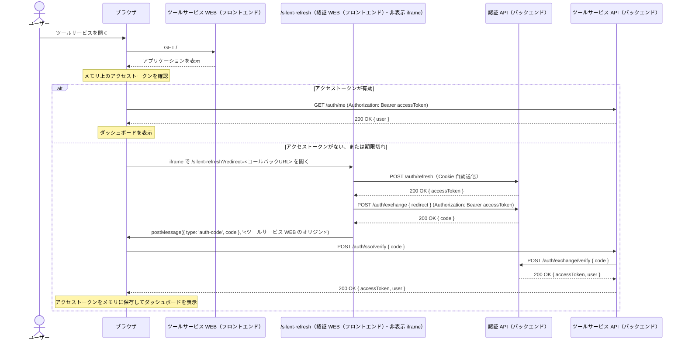
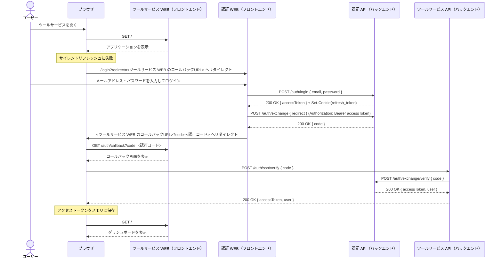
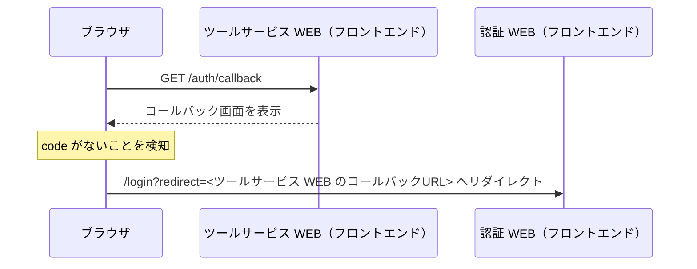
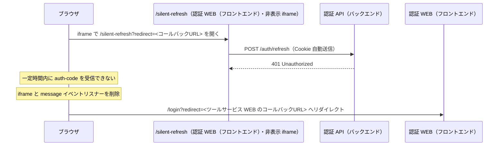
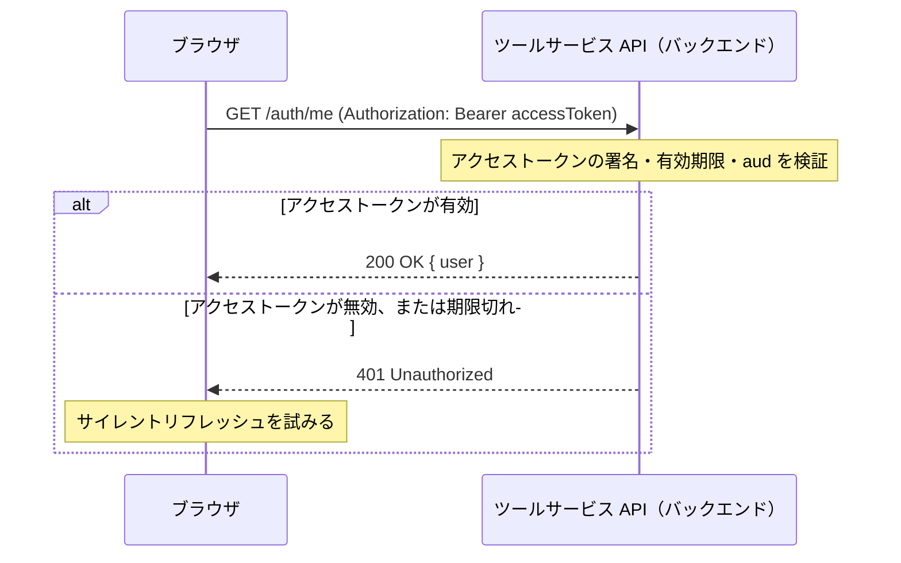
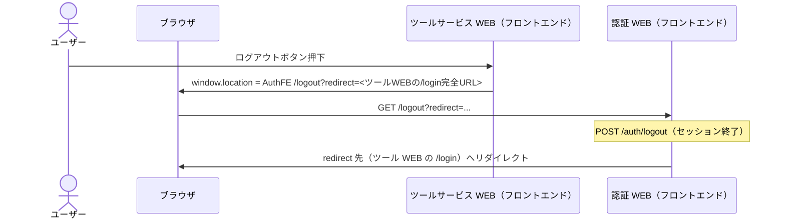

# ツールサービス設計 - Waddle Inc. ツールサービス

このドキュメントはツールサービスの設計を概念レベルで記述しており、実装の詳細（使用ライブラリ・関数名・環境変数名など）は各アプリのソースコードおよびコメントを参照してください。

> **閲覧環境について**
> Mermaid 図は [Mermaid 対応エディタ](https://mermaid.js.org/)（GitHub、Obsidian 等）で正しくレンダリングされます。

---

## 目次

<!-- toc -->

- [認証設計](#%E8%AA%8D%E8%A8%BC%E8%A8%AD%E8%A8%88)
  - [トークン一覧](#%E3%83%88%E3%83%BC%E3%82%AF%E3%83%B3%E4%B8%80%E8%A6%A7)
  - [トークン保存方針](#%E3%83%88%E3%83%BC%E3%82%AF%E3%83%B3%E4%BF%9D%E5%AD%98%E6%96%B9%E9%87%9D)
  - [API 認証方針](#api-%E8%AA%8D%E8%A8%BC%E6%96%B9%E9%87%9D)
- [認証フロー](#%E8%AA%8D%E8%A8%BC%E3%83%95%E3%83%AD%E3%83%BC)
  - [画面一覧](#%E7%94%BB%E9%9D%A2%E4%B8%80%E8%A6%A7)
  - [API 一覧](#api-%E4%B8%80%E8%A6%A7)
  - [アクター](#%E3%82%A2%E3%82%AF%E3%82%BF%E3%83%BC)
  - [凡例](#%E5%87%A1%E4%BE%8B)
  - [フロー一覧](#%E3%83%95%E3%83%AD%E3%83%BC%E4%B8%80%E8%A6%A7)
    - [初回アクセス](#%E5%88%9D%E5%9B%9E%E3%82%A2%E3%82%AF%E3%82%BB%E3%82%B9)
    - [ログインフロー（未認証ユーザー）](#%E3%83%AD%E3%82%B0%E3%82%A4%E3%83%B3%E3%83%95%E3%83%AD%E3%83%BC%E6%9C%AA%E8%AA%8D%E8%A8%BC%E3%83%A6%E3%83%BC%E3%82%B6%E3%83%BC)
    - [SSO コールバックで認可コードがない場合](#sso-%E3%82%B3%E3%83%BC%E3%83%AB%E3%83%90%E3%83%83%E3%82%AF%E3%81%A7%E8%AA%8D%E5%8F%AF%E3%82%B3%E3%83%BC%E3%83%89%E3%81%8C%E3%81%AA%E3%81%84%E5%A0%B4%E5%90%88)
    - [サイレントリフレッシュ失敗](#%E3%82%B5%E3%82%A4%E3%83%AC%E3%83%B3%E3%83%88%E3%83%AA%E3%83%95%E3%83%AC%E3%83%83%E3%82%B7%E3%83%A5%E5%A4%B1%E6%95%97)
    - [API 認証](#api-%E8%AA%8D%E8%A8%BC)
    - [ログアウト](#%E3%83%AD%E3%82%B0%E3%82%A2%E3%82%A6%E3%83%88)
- [ダッシュボード設計](#%E3%83%80%E3%83%83%E3%82%B7%E3%83%A5%E3%83%9C%E3%83%BC%E3%83%89%E8%A8%AD%E8%A8%88)
  - [表示内容](#%E8%A1%A8%E7%A4%BA%E5%86%85%E5%AE%B9)
  - [初期表示方針](#%E5%88%9D%E6%9C%9F%E8%A1%A8%E7%A4%BA%E6%96%B9%E9%87%9D)
- [ツール一覧](#%E3%83%84%E3%83%BC%E3%83%AB%E4%B8%80%E8%A6%A7)
- [ブラウザ情報ツール](#%E3%83%96%E3%83%A9%E3%82%A6%E3%82%B6%E6%83%85%E5%A0%B1%E3%83%84%E3%83%BC%E3%83%AB)
  - [表示項目](#%E8%A1%A8%E7%A4%BA%E9%A0%85%E7%9B%AE)
- [ダウンロード速度測定ツール](#%E3%83%80%E3%82%A6%E3%83%B3%E3%83%AD%E3%83%BC%E3%83%89%E9%80%9F%E5%BA%A6%E6%B8%AC%E5%AE%9A%E3%83%84%E3%83%BC%E3%83%AB)
  - [表示項目・計測方式](#%E8%A1%A8%E7%A4%BA%E9%A0%85%E7%9B%AE%E3%83%BB%E8%A8%88%E6%B8%AC%E6%96%B9%E5%BC%8F)
- [文章要約ツール](#%E6%96%87%E7%AB%A0%E8%A6%81%E7%B4%84%E3%83%84%E3%83%BC%E3%83%AB)
  - [要約の長さ](#%E8%A6%81%E7%B4%84%E3%81%AE%E9%95%B7%E3%81%95)
  - [処理方式](#%E5%87%A6%E7%90%86%E6%96%B9%E5%BC%8F)

<!-- tocstop -->

---

## 認証設計

ツールサービスは認証システムの SSO を利用し、ログイン済みユーザーだけが利用できるサービスとして提供します。  
ユーザー登録・ログイン・パスワード管理は認証システムへ委譲し、ツールサービスでは認証済みユーザーの確認とサービス内画面の保護を担当します。

### トークン一覧

ツールサービスが扱うトークンと一時コードは以下の通りです。

| 名前                               | 用途                                       | 形式   | 有効期限 | 発行元                   |
| ---------------------------------- | ------------------------------------------ | ------ | -------- | ------------------------ |
| SSO 認可コード                     | ツールサービス向けアクセストークンとの交換 | 文字列 | 60 秒    | 認証 API（バックエンド） |
| ツールサービス向けアクセストークン | ツールサービス API（バックエンド）の認証   | JWT    | 15 分    | 認証 API（バックエンド） |
| 認証システムのリフレッシュトークン | 認証システム側セッションの維持             | JWT    | 7 日     | 認証 API（バックエンド） |

> **備考**
> 認証システムのリフレッシュトークンは認証システムの HttpOnly Cookie として管理されます。ツールサービスは値を直接読み取りません。

---

### トークン保存方針

| 名前                               | ツールサービス WEB（フロントエンド）での保存場所 | ツールサービス API（バックエンド）での保存内容 |
| ---------------------------------- | ------------------------------------------------ | ---------------------------------------------- |
| SSO 認可コード                     | URL パラメータまたはメモリ                       | 保存しない                                     |
| ツールサービス向けアクセストークン | メモリ（JS 変数）                                | 保存しない（JWT 自己完結）                     |
| 認証システムのリフレッシュトークン | 保存しない                                       | 保存しない                                     |

> **セキュリティ上の注意**
> ツールサービス向けアクセストークンは `localStorage` や `sessionStorage` に保存せず、メモリ保持を原則とします。
> 認証状態の復元が必要な場合は、認証 WEB（フロントエンド）のサイレントリフレッシュを利用して新しい SSO 認可コードを取得します。

---

### API 認証方針

ツールサービス WEB（フロントエンド）からツールサービス API（バックエンド）への認証は、ツールサービス向けアクセストークンを `Authorization` ヘッダーで送信します。

```text
Authorization: Bearer <ツールサービス向けアクセストークン>
```

ツールサービス API（バックエンド）はアクセストークンを検証し、以下を確認します。

| 確認項目 | 内容                                             |
| -------- | ------------------------------------------------ |
| 署名     | 認証システムと共有する方式で JWT 署名を検証する  |
| 有効期限 | `exp` が期限切れでないことを確認する             |
| 受信者   | `aud` がツールサービス向けであることを確認する   |
| ユーザー | `sub`, `email`, `roles` をユーザー情報として扱う |

---

## 認証フロー

### 画面一覧

| 画面名           | エンドポイント       | 概要                                                              |
| ---------------- | -------------------- | ----------------------------------------------------------------- |
| ダッシュボード   | `GET /`              | ログイン後に表示する初期画面                                      |
| SSO コールバック | `GET /auth/callback` | 認証 WEB（フロントエンド）から返却された SSO 認可コードを受け取る |

---

### API 一覧

| メソッド | パス               | 概要                                                                           |
| -------- | ------------------ | ------------------------------------------------------------------------------ |
| `POST`   | `/auth/sso/verify` | SSO 認可コードを検証し、ツールサービス向けアクセストークンとユーザー情報を返す |
| `GET`    | `/auth/me`         | ツールサービス向けアクセストークンからログイン中ユーザー情報を返す             |

---

### アクター

| 名称                                 | 役割                                                                      |
| ------------------------------------ | ------------------------------------------------------------------------- |
| ユーザー                             | ツールサービスを利用する人物                                              |
| ツールサービス WEB（フロントエンド） | ツールサービスの画面を提供し、認証状態に応じて画面遷移を制御する          |
| ツールサービス API（バックエンド）   | ツールサービスの API を提供し、SSO 認可コードとアクセストークンを検証する |
| 認証 WEB（フロントエンド）           | ログイン画面およびサイレントリフレッシュ用 iframe を提供する              |
| 認証 API（バックエンド）             | 認証処理・SSO 認可コードの発行および検証を担う                            |

---

### 凡例

| 記法            | 意味                         |
| --------------- | ---------------------------- |
| 実線（`->>` ）  | リクエスト（処理要求）       |
| 破線（`-->>` ） | レスポンス（処理結果の返却） |

---

### フロー一覧

#### 初回アクセス

ユーザーがツールサービスへアクセスした際に、メモリ上のアクセストークンまたは認証システムの既存セッションを確認するフローです。



---

#### ログインフロー（未認証ユーザー）

認証システムにログインしていないユーザーを認証 WEB（フロントエンド）へリダイレクトし、SSO 認可コードでツールサービスの認証状態を確立するフローです。



---

#### SSO コールバックで認可コードがない場合

認証 WEB（フロントエンド）からコールバック URL へ戻ったものの、`code` クエリパラメータが存在しない場合のフローです。



---

#### サイレントリフレッシュ失敗

認証システムのセッションが存在しない、期限切れ、または通信エラーでサイレントリフレッシュに失敗した場合のフローです。



---

#### API 認証

ツールサービス WEB（フロントエンド）がツールサービス API（バックエンド）を呼び出す際の認証フローです。



---

#### ログアウト

ツールサービスのログアウトは、認証 WEB（フロントエンド）の `/logout` へ遷移するシングルログアウト方式です。認証システム側のセッション（リフレッシュトークン Cookie）も終了します。`redirect` クエリにツールサービス WEB の [`/login`](./web/screens/login.md) の**完全な URL**を付与し、ログアウト完了後に同画面へ戻します。詳細は [トークン管理設計](./web/tokens.md) および [SSO 連携ガイド](../auth/sso-guide.md#ログアウト) を参照してください。



---

## ダッシュボード設計

Phase 1-b では、認証後に遷移できる最小限のダッシュボード骨格を用意します。ツール一覧や共通レイアウトの詳細は Phase 2 で設計します。

### 表示内容

| 項目           | 内容                                                                                                       |
| -------------- | ---------------------------------------------------------------------------------------------------------- |
| ユーザー情報   | ログイン中ユーザーのメールアドレスなど、認証確認に必要な最小情報                                           |
| ログアウト操作 | 認証 WEB の `/logout`（`redirect` に `/login` 完全 URL）へ遷移し、セッション終了後にログイン画面へ戻る操作 |
| ツール領域     | Phase 2 以降でツール一覧・各ツールへの導線を配置する領域                                                   |

---

### 初期表示方針

| 状態       | 表示・処理                                        |
| ---------- | ------------------------------------------------- |
| 認証確認中 | ローディング表示                                  |
| 認証済み   | ダッシュボードを表示                              |
| 未認証     | [`/login`](./web/screens/login.md) へリダイレクト |
| 認証エラー | エラーメッセージを表示し、再ログイン導線を表示    |

---

## ツール一覧

| ID               | 名前                 | パス                    | 概要                                                       |
| ---------------- | -------------------- | ----------------------- | ---------------------------------------------------------- |
| `browser-info`   | ブラウザ情報         | `/tools/browser-info`   | ブラウザと接続環境の情報を一覧表示するツール               |
| `download-speed` | ダウンロード速度測定 | `/tools/download-speed` | サーバーからのバイナリ取得時間から回線の下り速度を推定する |
| `summarize`      | 文章要約             | `/tools/summarize`      | テキストを入力すると AI が要約するツール                   |

---

## ブラウザ情報ツール

ブラウザ情報ツールは、ブラウザ API とツールサービス API を組み合わせて、表示環境の情報を確認できるようにします。

### 表示項目

| 項目                 | 取得元                                                          |
| -------------------- | --------------------------------------------------------------- |
| IP アドレス          | バックエンド `GET /tools/browser-info` の `client_ip`           |
| ユーザーエージェント | `navigator.userAgent`                                           |
| 言語設定             | `navigator.language` / `navigator.languages`                    |
| プラットフォーム     | `navigator.platform`                                            |
| ベンダー             | `navigator.vendor`                                              |
| タイムゾーン         | `Intl.DateTimeFormat().resolvedOptions().timeZone`              |
| 画面解像度           | `screen.width` × `screen.height`                                |
| 利用可能画面サイズ   | `screen.availWidth` × `screen.availHeight`                      |
| 画面の向き           | `screen.orientation.type`                                       |
| 色深度               | `screen.colorDepth`                                             |
| ビューポートサイズ   | `window.innerWidth` × `window.innerHeight`                      |
| デバイスピクセル比   | `window.devicePixelRatio`                                       |
| CPU コア数           | `navigator.hardwareConcurrency`                                 |
| タッチポイント数     | `navigator.maxTouchPoints`                                      |
| デバイスメモリ       | `navigator.deviceMemory`                                        |
| ネットワーク接続速度 | `navigator.connection.effectiveType`                            |
| 推定下り帯域         | `navigator.connection.downlink`                                 |
| 往復遅延             | `navigator.connection.rtt`                                      |
| データセーバー       | `navigator.connection.saveData`                                 |
| オンライン状態       | `navigator.onLine`                                              |
| Cookie 有効          | `navigator.cookieEnabled`                                       |
| カラースキーム       | `window.matchMedia('(prefers-color-scheme: dark)').matches`     |
| アニメーション軽減   | `window.matchMedia('(prefers-reduced-motion: reduce)').matches` |
| ハイコントラスト     | `window.matchMedia('(prefers-contrast: more)').matches`         |

---

## ダウンロード速度測定ツール

ダウンロード速度測定ツールは、認証済みユーザーが選択したデータサイズ分のランダムバイト列をツールサービス API から取得し、クライアント側で経過時間を計測して **Mbps（メガビット毎秒）** に換算して表示します。計測はユーザーの「計測開始」操作でのみ実行され、計測中は中止できます。

### 表示項目・計測方式

| 項目             | 内容                                                                                                                           |
| ---------------- | ------------------------------------------------------------------------------------------------------------------------------ |
| 計測結果         | 取得バイト数と経過時間から算出した下り速度（Mbps）。小数第 2 位まで表示する想定                                                |
| 計測サイズ       | ユーザーが選択した取得サイズ（10 / 50 / 100 MB）。API の `size_mb` クエリに対応                                                |
| 所要時間         | `performance.now()` などで計測した、チャンク取得開始から完了までの経過時間（ミリ秒）                                           |
| 計測状態         | 待機（サイズ選択可）／計測中／完了／エラー（タイムアウト・中止・API 失敗など）                                                 |
| 計測の前提       | `GET /tools/download-speed/chunk` が `application/octet-stream` で指定サイズのバイト列を返すこと                               |
| タイムアウト     | フロントエンドで計測開始から 30 秒を超えた場合はエラーとして打ち切り（低速回線で大サイズを選んだ場合の長時間ブロックを避ける） |
| 計測方式（算出） | Mbps = `(size_mb × 1024 × 1024 × 8) / (経過秒) / 1_000_000`（ビット量を秒で割り、メガ単位に換算）                              |

---

## 文章要約ツール

文章要約ツールは、認証済みユーザーが入力したテキストをツールサービス API 経由で Google Gemini（**Gemini 2.5 Flash Lite**）に送り、**一括レスポンス**（ストリーミングなし）で返った要約を画面に表示します。

### 要約の長さ

ユーザーは **短め**（`short`）／**普通**（`medium`）／**詳しく**（`long`）から要約の分量を選びます。選択値は `POST /tools/summarize` の `length` に渡され、サーバー側のプロンプトで分量指示（おおよそ 1〜2 文／3〜5 文／7〜10 文）に反映されます。

### 処理方式

- **使用モデル:** `gemini-2.5-flash-lite`
- **API 呼び出し:** フロントエンドは認証付きで `POST /tools/summarize` を呼び出し、バックエンドが Gemini API と通信する
- **レスポンス:** ストリーミングは用いず、完了後に JSON の `summary` を表示する
