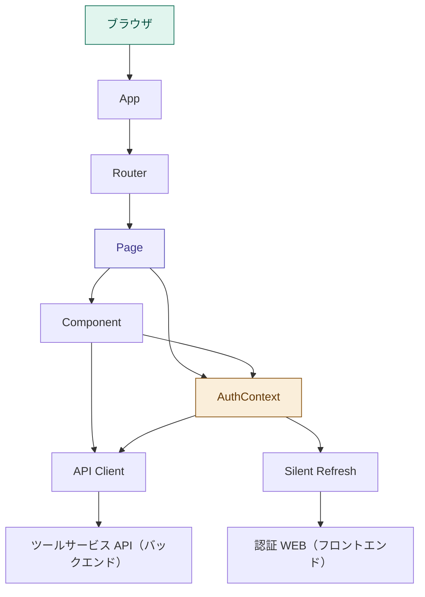
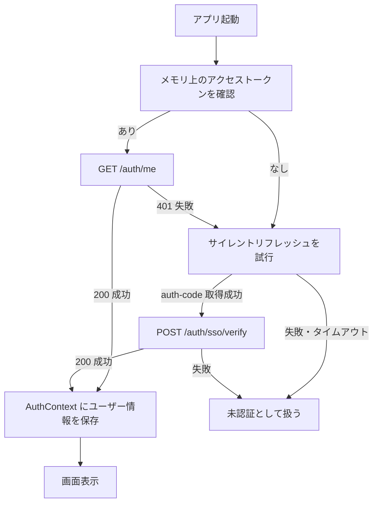

# アーキテクチャ設計 - Waddle Inc. ツールサービス WEB

このドキュメントはツールサービス WEB のアーキテクチャ設計を記述しています。

> **閲覧環境について**  
> Mermaid 図は [Mermaid 対応エディタ](https://mermaid.js.org/)（GitHub、Obsidian 等）で正しくレンダリングされます。

---

## 目次

<!-- toc -->

- [概要](#%E6%A6%82%E8%A6%81)
- [レイヤー設計](#%E3%83%AC%E3%82%A4%E3%83%A4%E3%83%BC%E8%A8%AD%E8%A8%88)
- [各レイヤーの責務](#%E5%90%84%E3%83%AC%E3%82%A4%E3%83%A4%E3%83%BC%E3%81%AE%E8%B2%AC%E5%8B%99)
  - [App](#app)
  - [Router](#router)
  - [Page](#page)
  - [Component](#component)
  - [API Client](#api-client)
  - [Context](#context)
  - [Silent Refresh](#silent-refresh)
- [AuthContext](#authcontext)
  - [アプリ起動時の認証状態復元フロー](#%E3%82%A2%E3%83%97%E3%83%AA%E8%B5%B7%E5%8B%95%E6%99%82%E3%81%AE%E8%AA%8D%E8%A8%BC%E7%8A%B6%E6%85%8B%E5%BE%A9%E5%85%83%E3%83%95%E3%83%AD%E3%83%BC)
  - [トークン管理](#%E3%83%88%E3%83%BC%E3%82%AF%E3%83%B3%E7%AE%A1%E7%90%86)
  - [ルート保護](#%E3%83%AB%E3%83%BC%E3%83%88%E4%BF%9D%E8%AD%B7)
- [エラーハンドリング方針](#%E3%82%A8%E3%83%A9%E3%83%BC%E3%83%8F%E3%83%B3%E3%83%89%E3%83%AA%E3%83%B3%E3%82%B0%E6%96%B9%E9%87%9D)
- [UI モックアップ](#ui-%E3%83%A2%E3%83%83%E3%82%AF%E3%82%A2%E3%83%83%E3%83%97)

<!-- tocstop -->

## 概要

ツールサービス WEB（フロントエンド）は React + Vite の SPA を軸に、以下のレイヤーで構成します。  
Phase 2 では、認証状態の管理に加えて `AppLayout` による共通ガードとツール一覧画面の骨格を提供します。

---

## レイヤー設計

React + Vite の SPA を前提に、App・Router・Layout・Page・Component・API Client・Context の層へ責務を分離します。

| レイヤー       | 主な役割                                                | 主なファイル                |
| -------------- | ------------------------------------------------------- | --------------------------- |
| App            | アプリ全体の Provider と Router を組み立てる            | `src/App.tsx`               |
| Router         | URL パスに応じて Page を切り替える                      | `src/routes/`               |
| Layout         | 認証ガードと共通ヘッダーを提供する                      | `src/layouts/**/*.tsx`      |
| Page           | ルーティング単位。画面の組み立てを担う                  | `src/pages/**/*.tsx`        |
| Component      | UI の描画とユーザー操作を扱う                           | `src/components/**/*.tsx`   |
| API Client     | ツールサービス API（バックエンド）との通信を担う        | `src/lib/api.ts`            |
| Context        | アプリ全体の認証状態を保持する                          | `src/contexts/`             |
| Silent Refresh | 認証 WEB（フロントエンド）から SSO 認可コードを取得する | `src/lib/silent-refresh.ts` |

---

## 各レイヤーの責務

### App

**ファイル**: `src/App.tsx`

アプリ全体の Provider と Router を組み立てます。

**担当する処理**:

- `AuthProvider` の適用
- Router の配置
- アプリ共通レイアウトの適用

**担当しない処理**:

- 画面固有の UI 描画（Page / Component へ委譲）
- API リクエストの送信（API Client へ委譲）
- 認証状態の詳細管理（AuthContext へ委譲）

---

### Router

**ファイル**: `src/routes/`

URL パスに応じて表示する Page を切り替えます。

**担当する処理**:

- `/` と `/auth/callback` のルーティング
- 未定義ルートの `/` へのリダイレクト
- ルート種別に応じたガード適用

**担当しない処理**:

- 認証状態の保持
- SSO 認可コードの検証
- API 通信の詳細

---

### Page

**ファイル**: `src/pages/**/*.tsx`

ルーティング単位として、画面の組み立てを担います。

**担当する処理**:

- ページ単位の状態分岐
- Component の呼び出し
- Layout に委譲される前提での画面組み立て
- 画面遷移の起点

**担当しない処理**:

- 細かな UI 部品の描画（Component へ委譲）
- API クライアントの設定
- トークンの保持・再認証

---

### Component

**ファイル**: `src/components/**/*.tsx`

UI の描画とユーザー操作を扱います。

**担当する処理**:

- ユーザー情報カードなどの表示
- ローディング・エラー状態の表示
- ログアウトボタンなどのユーザー操作

**担当しない処理**:

- 認証状態の保持
- SSO 認可コードの検証
- API 通信の共通設定

---

### API Client

**ファイル**: `src/lib/api.ts`

ツールサービス API（バックエンド）との通信を担います。

**担当する処理**:

- API ベース URL の一元設定
- `Content-Type: application/json` の付与
- 認証が必要なリクエストへの `Authorization: Bearer` ヘッダー付与
- `GET /auth/me` の呼び出し
- `POST /auth/sso/verify` の呼び出し
- `401 Unauthorized` 受信時の再認証フック呼び出し

**担当しない処理**:

- アクセストークンの永続化
- UI 表示
- 画面遷移

---

### Context

アプリ全体の状態を保持する React Context レイヤーです。

**担当する処理**:

- 認証状態の提供
- ユーザー情報の保持
- ツールサービス向けアクセストークンのメモリ保持
- ログアウト処理（認証 WEB の `/logout` に `redirect`〈ツール WEB の `/login` 完全 URL〉を付与して `window.location` で遷移）
- 認証状態の初期化

**担当しない処理**:

- 画面 UI の描画
- API 通信の詳細実装
- iframe や `postMessage` の低レベル処理

---

### Silent Refresh

**ファイル**: `src/lib/silent-refresh.ts`

認証 WEB（フロントエンド）の `/silent-refresh` を非表示 iframe で開き、`postMessage` で SSO 認可コードを受け取ります。

**担当する処理**:

- 非表示 iframe の作成
- `message` イベントの購読
- `event.origin` の検証
- タイムアウト処理
- iframe とイベントリスナーのクリーンアップ

**担当しない処理**:

- SSO 認可コードの検証 API 呼び出し
- アクセストークンの保存
- 画面遷移

---

## AuthContext

**ファイル**: `src/contexts/auth-context.tsx`

ツールサービス向けアクセストークン、ユーザー情報、認証状態をメモリで保持し、アプリ全体に提供する Context です。

### アプリ起動時の認証状態復元フロー

アプリ起動時にメモリ上のアクセストークンを確認します。アクセストークンがない場合や `GET /auth/me` が `401` を返した場合は、認証 WEB（フロントエンド）のサイレントリフレッシュを試行して認証状態を復元します。アクセストークンがあり `GET /auth/me` が `200` であれば認証済みとしてユーザー情報を保存します。

### トークン管理

ツールサービス向けアクセストークンはメモリで保持します。`localStorage` や `sessionStorage` には保存しません。

| 値                                 | 保存場所               |
| ---------------------------------- | ---------------------- |
| ツールサービス向けアクセストークン | React Context のメモリ |
| ユーザー情報                       | React Context のメモリ |
| SSO 認可コード                     | 保存しない             |

詳細は [トークン管理設計](./tokens.md) を参照してください。

### ルート保護

ルートを次のように分類し、**クライアント側（`AuthContext`）** でリダイレクトを行います。

| 種別         | ルート           | 未認証時                | 認証済み時         |
| ------------ | ---------------- | ----------------------- | ------------------ |
| 要認証ルート | `/`              | `/login` へリダイレクト | アクセス可         |
| 公開ルート   | `/login`         | アクセス可              | `/` へリダイレクト |
| 中立ルート   | `/auth/callback` | アクセス可              | アクセス可         |

詳細は [ルート保護設計](./routing.md) を参照してください。

---

## エラーハンドリング方針

| ステータス・事象                     | 意味                                         | フロントエンドの対応方針                                                                  |
| ------------------------------------ | -------------------------------------------- | ----------------------------------------------------------------------------------------- |
| `400`                                | リクエスト不正                               | エラーメッセージを表示し、再ログイン導線を表示                                            |
| `401`                                | 認証失敗 / トークン失効                      | `refreshAccessToken()` でサイレントリフレッシュを試行し、失敗時は `/login` へリダイレクト |
| `403`                                | `aud` 不一致などの権限エラー                 | 認証状態を破棄し、`/login` へ誘導                                                         |
| `500`                                | サーバーエラー                               | 汎用エラーメッセージを表示                                                                |
| サイレントリフレッシュのタイムアウト | 認証システム側セッションなし、または通信失敗 | `/login` へリダイレクト                                                                   |
| `postMessage` の origin 不一致       | 不正な送信元からのメッセージ                 | メッセージを無視                                                                          |

---

## UI モックアップ

Phase 1-b では UI モックアップ専用ファイルは用意しません。画面仕様は [画面一覧](./screens/README.md) と各画面仕様を参照します。

| 画面             | 仕様                                               |
| ---------------- | -------------------------------------------------- |
| ログイン         | [ログイン画面](./screens/login.md)                 |
| ツール一覧       | [ツール一覧画面](./screens/tool-list.md)           |
| SSO コールバック | [SSO コールバック画面](./screens/auth-callback.md) |
