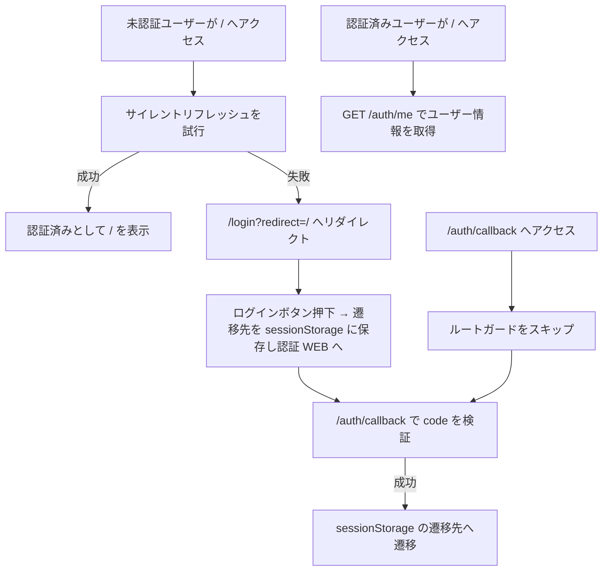

# ルート保護設計 - Waddle Inc. ツールサービス WEB

このドキュメントはツールサービス WEB のルート保護設計を記述しています。

---

## 公開ルート

未認証ユーザーがそのまま利用できる公開ルートとして、次を用意します。

- [`/login`](./screens/login.md)（ログイン画面）

未認証ユーザーが要認証ルートへアクセスした場合は、サイレントリフレッシュで認証状態の復元を試み、失敗した場合は [`/login?redirect=<元のパス>`](./screens/login.md) へリダイレクトします。ログイン完了後は元のページへ自動遷移します。

## 要認証ルート

認証状態が未確立のユーザーがアクセスした場合は、サイレントリフレッシュで認証状態の復元を試み、失敗した場合は [`/login?redirect=<元のパス>`](./screens/login.md) へリダイレクトします。

- [`/`](./screens/tool-list.md)（ツール一覧）
- [`/tools/download-speed`](./screens/download-speed.md)（ダウンロード速度測定）

## 中立ルート（認証状態を問わずアクセス可）

認証状態を問わずアクセスできるルートです。ルートガードによるリダイレクトは行いません:

- [`/auth/callback`](./screens/auth-callback.md)（認証 WEB（フロントエンド）から SSO 認可コードを受け取るため）

## ルートガードの実装方式

ツールサービス WEB（フロントエンド）は React + Vite の SPA として提供するため、認証状態に基づくリダイレクトは **`AppLayout` と AuthContext** で実施します。

ツールサービス向けアクセストークンはメモリ保持を原則とし、`localStorage` や `sessionStorage` には保存しません。ページリロードなどでメモリ上のアクセストークンが失われた場合は、サイレントリフレッシュで認証状態の復元を試みます。失敗した場合は [`/login`](./screens/login.md) へ案内します。

> **認証状態の判定:** ツールサービス WEB（フロントエンド）は、メモリ上のツールサービス向けアクセストークンと `GET /auth/me` の結果で認証状態を判定します。アクセストークンがない場合や `GET /auth/me` が `401` の場合はサイレントリフレッシュを試行し、失敗時は要認証ルートでは `/login` へリダイレクトします。詳細は [トークン管理設計](./tokens.md) を参照してください。

## `/auth/callback` の扱い

`/auth/callback` は SSO 認可コードを受け取るための中立ルートです。認証済みユーザーがアクセスしても即時リダイレクトせず、クエリパラメータの内容に基づいて処理します。

| 条件                | 処理                                                                                                      |
| ------------------- | --------------------------------------------------------------------------------------------------------- |
| `code` がある       | `POST /auth/sso/verify` で SSO 認可コードを検証し、成功後 `sessionStorage` の遷移先（なければ `/`）へ遷移 |
| `code` がない       | [`/login`](./screens/login.md) へリダイレクト                                                             |
| `code` の検証に失敗 | 認証状態を破棄し、[`/login`](./screens/login.md) へリダイレクト                                           |

## 未定義ルート

未定義ルートへアクセスした場合は `/` へリダイレクトします。  
`/` 側で認証状態を判定し、未認証の場合はサイレントリフレッシュを試行し、失敗した場合は [`/login`](./screens/login.md) へリダイレクトします。
