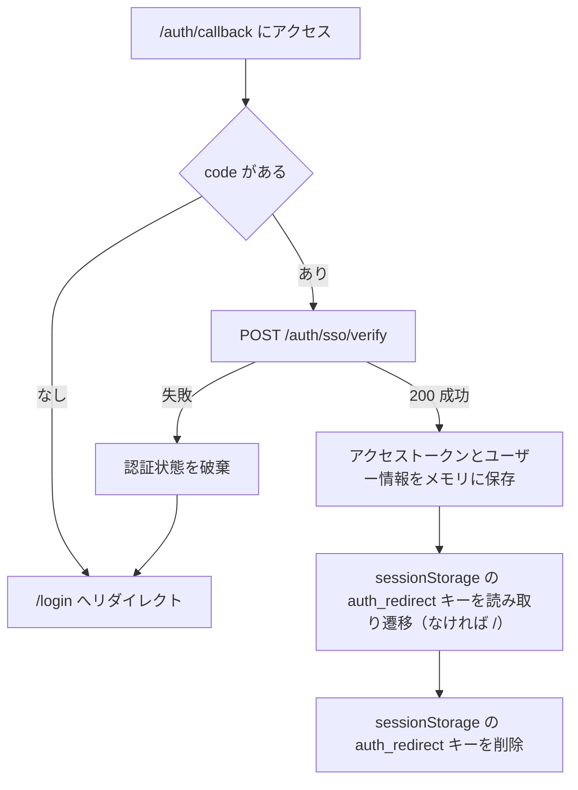

# SSO コールバック画面

**パス:** `/auth/callback`

**種別:** 中立（認証状態を問わずアクセス可）

**使用 API:** `POST /auth/sso/verify`

> 認証 WEB（フロントエンド）から返却された SSO 認可コードを受け取り、ツールサービスの認証状態を確立するための中継画面です。ユーザーが長時間操作する画面ではなく、処理完了後は自動的に元のページ（`sessionStorage` の `auth_redirect` キーが指すパス、なければ `/`）へ遷移します。

## 受け取るパラメータ

| パラメータ | 必須 | 説明                                                    |
| ---------- | ---- | ------------------------------------------------------- |
| `code`     | ✓    | 認証 WEB（フロントエンド）から返却された SSO 認可コード |

## 動作仕様

- URL クエリパラメータから `code` を取得する
- `code` がある場合は `POST /auth/sso/verify` に送信する
- 検証成功時はツールサービス向けアクセストークンとユーザー情報をメモリに保存する
- 検証成功後は `sessionStorage` の `auth_redirect` キーに保存されたパスへ遷移する（存在しない場合は `/`）
- 遷移後は `sessionStorage` の `auth_redirect` キーを削除する
- `code` は永続化しない
- 検証後は URL に `code` を残さない

## UI 要素

- 認証処理中のローディング表示
- エラーメッセージ表示エリア
- 再ログイン導線

## 画面遷移

| 条件            | 遷移先                                                                                             |
| --------------- | -------------------------------------------------------------------------------------------------- |
| `code` 検証成功 | `sessionStorage` の `auth_redirect` キーに保存されたパス（存在しない場合は [`/`](./tool-list.md)） |
| `code` がない   | [`/login`](./login.md) へリダイレクト                                                              |
| `code` 検証失敗 | 認証状態を破棄し、[`/login`](./login.md) へリダイレクト                                            |

## エラーハンドリング

| エラー                           | 表示・処理                                              |
| -------------------------------- | ------------------------------------------------------- |
| `code` がない                    | [`/login`](./login.md) へリダイレクト                   |
| `POST /auth/sso/verify` が `400` | エラーメッセージを表示し、再ログイン導線を表示          |
| `POST /auth/sso/verify` が `401` | 認証状態を破棄し、[`/login`](./login.md) へリダイレクト |
| `POST /auth/sso/verify` が `500` | エラーメッセージを表示し、再ログイン導線を表示          |

## 処理フロー

## 関連設計

- 種別の定義: [ルート保護設計](../routing.md)
- SSO 認可コードの扱い: [トークン管理設計](../tokens.md)
- API 仕様: [API 仕様](../../api/api.md)
