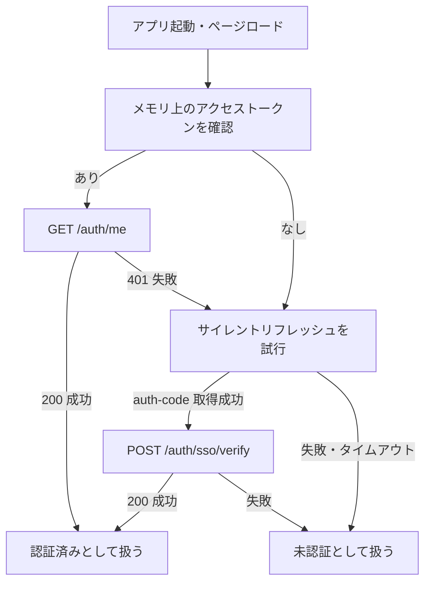
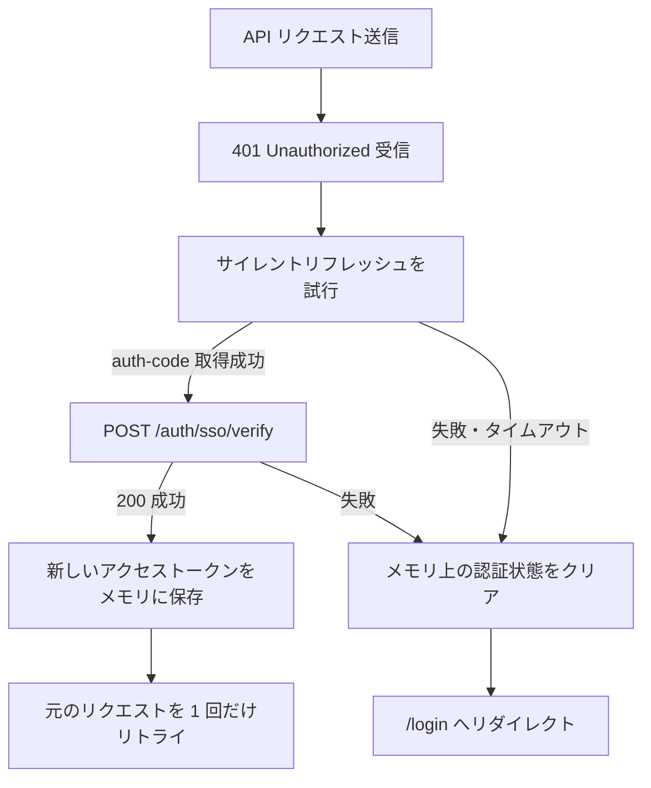
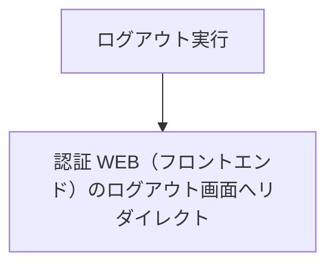

# トークン管理設計 - Waddle Inc. ツールサービス WEB

このドキュメントはツールサービス WEB のトークン管理設計を記述しています。

---

## 保存場所

| トークン                           | 保存場所                   | 理由                                                                                                            |
| ---------------------------------- | -------------------------- | --------------------------------------------------------------------------------------------------------------- |
| ツールサービス向けアクセストークン | メモリ内（React Context）  | XSS 対策。ページリロードで消える                                                                                |
| SSO 認可コード                     | URL パラメータまたはメモリ | 一時コードのため永続化しない                                                                                    |
| 認証システムのリフレッシュトークン | 保存しない                 | 認証 API（バックエンド）が HttpOnly Cookie として管理し、ツールサービス WEB（フロントエンド）からは読み取らない |

> **保存方針:** ツールサービス向けアクセストークンは `localStorage` や `sessionStorage` に保存しません。ページリロード等でメモリ上のアクセストークンが失われた場合は、認証 WEB（フロントエンド）のサイレントリフレッシュで復元します。

## SSO 認可コードの扱い

SSO 認可コードは、ツールサービス向けアクセストークンと交換するための一時コードです。

| 受け取り方法                               | 用途                           |
| ------------------------------------------ | ------------------------------ |
| `/auth/callback?code=<認可コード>`         | 未認証ユーザーのログインフロー |
| `postMessage({ type: 'auth-code', code })` | サイレントリフレッシュフロー   |

SSO 認可コードは以下の方針で扱います。

- 受け取ったら速やかに `POST /auth/sso/verify` で検証する
- 検証後はメモリにも永続ストレージにも保存しない
- `/auth/callback` で受け取った場合は、検証後に URL から `code` を残さない
- 検証に失敗した場合は認証状態を破棄し、`/login` へリダイレクトする

## 起動時の認証状態復元

ページロード時はメモリ上のツールサービス向けアクセストークンが失われている可能性があります。アクセストークンがない場合は、認証 WEB（フロントエンド）のサイレントリフレッシュを試行して認証状態を復元します。

## API 401 時の自動再認証

ツールサービス API（バックエンド）から `401 Unauthorized` を受け取った場合は、アクセストークンの期限切れまたは無効化とみなし、サイレントリフレッシュを試行します。

> **リトライ方針:** 無限リトライを避けるため、自動再認証後の元リクエストのリトライは 1 回までとします。

## ログアウト処理

ツールサービスのログアウトは認証 WEB（フロントエンド）のログアウト画面へリダイレクトします。認証システム側のセッションも同時に切れます。

ログアウト時の方針は以下の通りです。

- 認証 WEB（フロントエンド）の `/logout` へリダイレクトする（クエリ `redirect` にツールサービス WEB の `/login` の**完全な URL** を付与し、ログアウト完了後に当該画面へ戻す）
- auth セッション（リフレッシュトークン Cookie）が削除されるため、次のサイレントリフレッシュは失敗し `/login` へ誘導される

> **注:** `window.location.href` の書き換えによる全画面遷移では、React のメモリ上の状態（アクセストークン・ユーザー情報）はページアンロード時に自動破棄されます。また、ログアウト前に `setStatus('unauthenticated')` などで状態だけ未認証にすると、`DashboardPage` の未認証ガード（`useEffect`）が先に発火し、`window.location.href` を `/login` へ上書きしてしまうため、ログアウト処理では明示的なメモリクリアを行いません。

## セキュリティ考慮事項

- **アクセストークンはメモリのみに保持する**: `localStorage` や `sessionStorage` に保存すると XSS 攻撃で窃取されるリスクがあります。
- **SSO 認可コードは保存しない**: SSO 認可コードは短命かつ一回限りのため、検証後すぐ破棄します。
- **URL に `code` を残さない**: `/auth/callback` で検証に成功したら `/` へ遷移し、ブラウザ履歴に認可コードが残りにくいようにします。
- **postMessage のオリジンを検証する**: サイレントリフレッシュで `message` イベントを受け取る際は、`event.origin` が認証 WEB（フロントエンド）のオリジンと一致することを確認します。
- **iframe を必ずクリーンアップする**: 成功・失敗・タイムアウトのいずれでも iframe と `message` イベントリスナーを削除します。
- **認証 API（バックエンド）のリフレッシュトークンは直接扱わない**: ツールサービス WEB（フロントエンド）は認証システムの HttpOnly Cookie を読み取らず、認証 WEB（フロントエンド）経由で SSO 認可コードを取得します。
